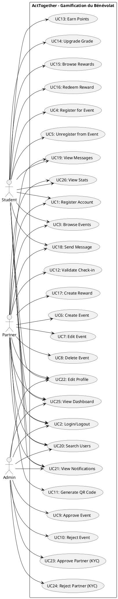

# UML UseCase Diagram - ActTogether

## PlantUML Code

## Use Cases Summary

| ID | Use Case | Actor |
|----|----------|-------|
| UC1 | Register Account | Student, Partner |
| UC2 | Login/Logout | All |
| UC3 | Browse Events | Student, Partner |
| UC4 | Register for Event | Student |
| UC5 | Unregister from Event | Student |
| UC6 | Create Event | Partner |
| UC7 | Edit Event | Partner |
| UC8 | Delete Event | Partner |
| UC9 | Approve Event | Admin |
| UC10 | Reject Event | Admin |
| UC11 | Generate QR Code | Partner |
| UC12 | Validate Check-in | Partner |
| UC13 | Earn Points | Student |
| UC14 | Upgrade Grade | Student |
| UC15 | Browse Rewards | Student |
| UC16 | Redeem Reward | Student |
| UC17 | Create Reward | Partner |
| UC18 | Send Message | All |
| UC19 | View Messages | All |
| UC20 | Search Users | All |
| UC21 | View Notifications | All |
| UC22 | Edit Profile | All |
| UC23 | Approve Partner (KYC) | Admin |
| UC24 | Reject Partner (KYC) | Admin |
| UC25 | View Dashboard | All |
| UC26 | View Stats | Student, Partner |

## Diagram Legend

- **Actors**: Student, Partner, Admin
- **Use Cases**: 26 distinct use cases organized by functionality
- **Relationships**: Association lines connecting actors to their use cases

## How to Use

1. Copy the PlantUML code above
2. Paste it into a PlantUML viewer (e.g., VS Code with PlantUML extension, plantuml.com)
3. Generate the diagram as PNG/SVG

The diagram follows standard UML use case notation with actors on the left and use cases inside the system boundary rectangle.
